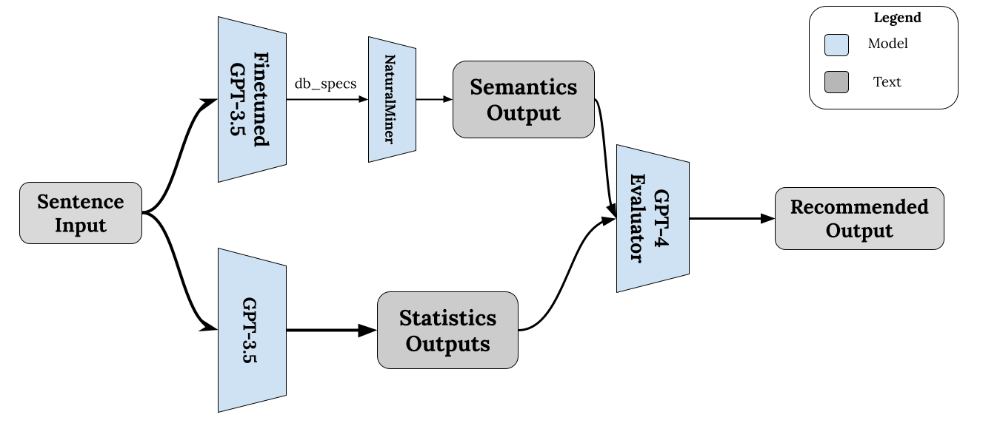

# SuperNaturalMiner

SuperNaturalMiner is an extension of the project [NaturalMiner](https://github.com/itrummer/NaturalMiner?tab=readme-ov-file), in which our model automatically autocompletes the sentence either based on 1. data statistics or 2. semantic reasoning.

This project employs Langchain to automatically generate SQL queries for the incomplete sentence to generate statistics and NaturalMiner to automatically generate semantic reasons. 

# Methodology
We depict our proposed methodology below:

 

# Installation
To setup your environment, perform the following commands:

```
conda create -n supernaturalminer python==3.10.0
conda activate supernaturalminer
pip install -r requirements.txt
```

## Installation for NaturalMiner
Please refer to the github [NaturalMiner](https://github.com/itrummer/NaturalMiner?tab=readme-ov-file) for setting up the NaturalMiner aspect of the project.


# Finetunin