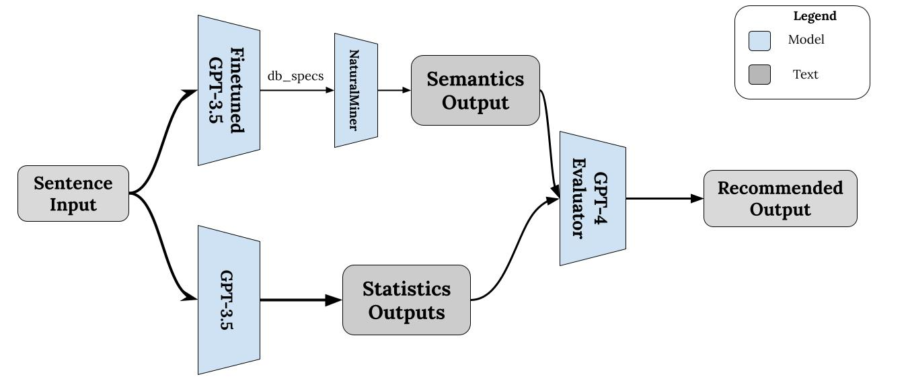

# SuperNaturalMiner

SuperNaturalMiner is an extension of the project [NaturalMiner](https://github.com/itrummer/NaturalMiner?tab=readme-ov-file), in which our model automatically autocompletes the sentence either based on 1. data statistics or 2. semantic reasoning.

This project employs Langchain to automatically generate SQL queries for the incomplete sentence to generate statistics and NaturalMiner to automatically generate semantic reasons. 

# Methodology
We depict our proposed methodology below:

 

1. We first finetune a GPT-3.5 model on our own custom dataset (See `finetune_dataset/data.jsonl`) to automatically the DB specifications that NaturalMiner requires in order to avoid requiring extra input from the user. This is extremely realistic and useful because the user now only requires a sentence that he/she wants to complete without having to worry about the DB specifications
2. To generate the statistics output, we perform zero-shot on a pretrained GPT-3.5 model.
3. Once the outputs are generated, we evaluate the outputs based on a custom prompt template (See `output_prompt_template.txt`) to determine the better output based on the given incomplete sentence.
4. The output is recommended to the user.

# Installation
To setup your environment, perform the following commands:

```
conda create -n supernaturalminer python==3.10.0
conda activate supernaturalminer
pip install -r requirements.txt
```

## Installation for NaturalMiner
Please refer to the github [NaturalMiner](https://github.com/itrummer/NaturalMiner?tab=readme-ov-file) for setting up the NaturalMiner aspect of the project.


# Finetuning
Run `finetune_llm.py` to upload the custom dataset and create a finetune job using the OpenAI API.

# Run Demo
Running the below command will run the GUI interface for SuperNaturalMiner

```
streamlit run src/nminer/interface/gui.py
```